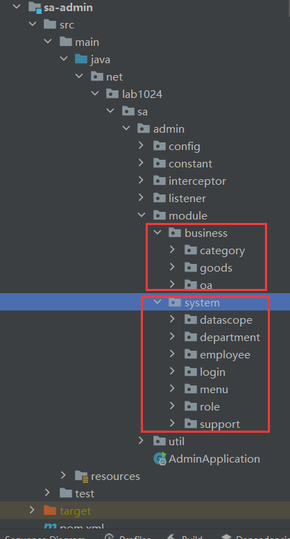
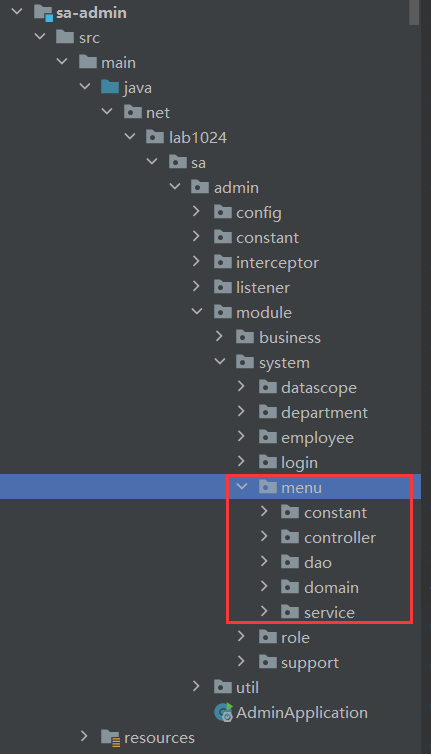

** {{ title }} ** <Excerpt in index | 首页摘要>

<!-- more -->

#### 设计1-分模块

如上图：
优点：如果要搞新的项目，system下基本上都是有用的，可以保留下来，
而business里的可以随便删除

如图：每个模块的controller、service、entity都分开，模块与模块直接不影响
缺点：
1、每个模块下都有controller、service、entity，导致包名重复 
2、一个service模块调用另外个service模块跨度较大
3、service api和serviceImpl没分开，后期改造成微服务不太好操作

#### 设计2-分模块

#### 设计1-分模块

1. 
2. 
3. 
