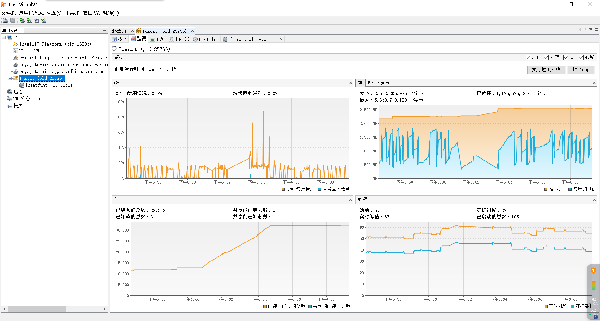

** {{ title }} ** <Excerpt in index | 首页摘要>


<!-- more -->

#### 问题
如图：生产环境上只要点导出数据，数据量大概60万，在某个机器下，内存飙升到5g，
然后就自动重启服务了，


#### 排查
利用jdk下的工具jvisualvm.exe，
具体路径D:\Program Files\Java80331\jdk1.8.0_331\bin\jvisualvm.exe

然后jvm设定为2g,即为-Xmx2048m，如下图用jvisualvm看

看图黄色的是申请的，蓝色的是使用的堆内存,但是始终没有超出2g

接着jvm改为5g，即为 -Xmx5120m，如下图用jvisualvm看

看图，看到随着内存加大，黄色申请的内存量也往上增，蓝色的也增长，但是始终还是没有超过2g

经上面分析本地暂时没有排查到具体的问题

#### 观察和搜索
经过本地的排查重现不了，只能继续看问题图，发现问题图应该是黄色的申请资源内存的曲线图，
而不是回收的图，如果是回收的至少是v图，即为一下一上的图，像本地测试那样才是正常，
而再看问题图发现几次点击是先平缓网上增内存，然后在某一个点突然间直线上升，
像申请的内存资源翻倍似的，于是在网上搜索“easyexcel内存溢出”，一搜马上看到
[记录一次EasyExcel2.2.6版本内存泄漏问题](https://blog.csdn.net/qq_42563471/article/details/128853588)

再看项目中引用的easyexcel版本，刚好是这个版本，所以问题根本在于内存溢出

#### 解决

```java

```

```java

```
[]()


```java

```

```java

```
[]()


```java

```

```java

```
[]()
```


1. 
2. 
3. 
