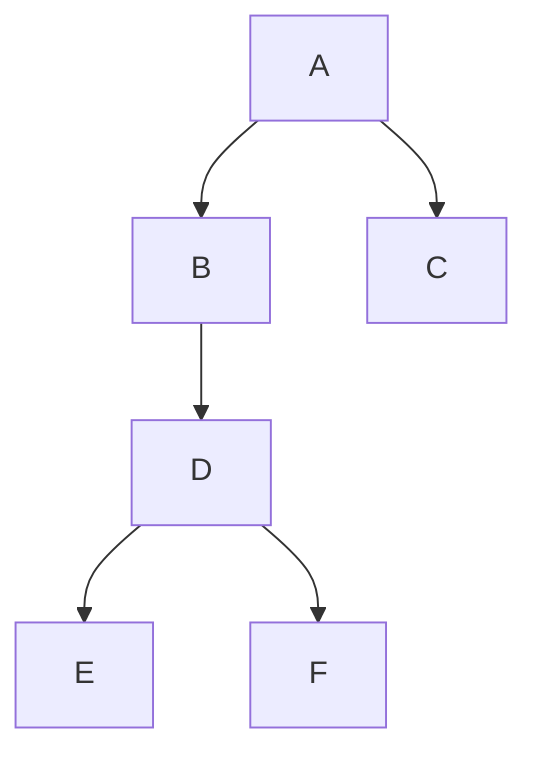
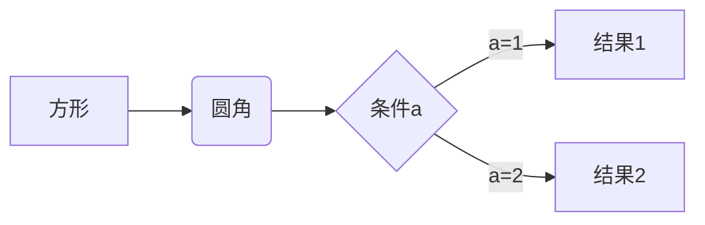
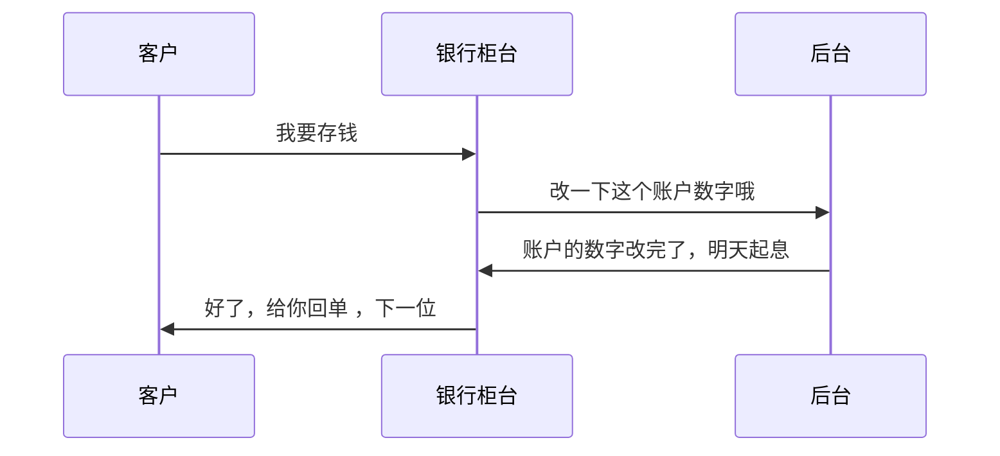
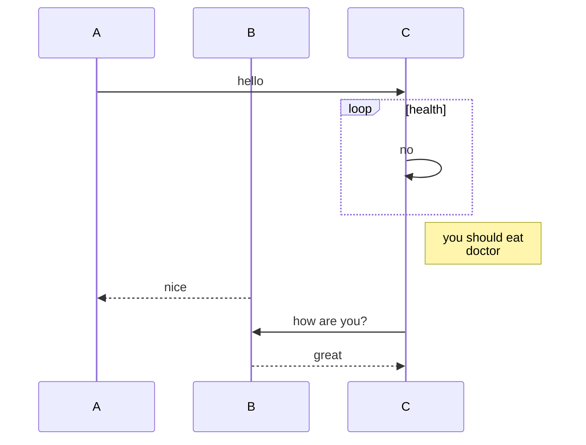
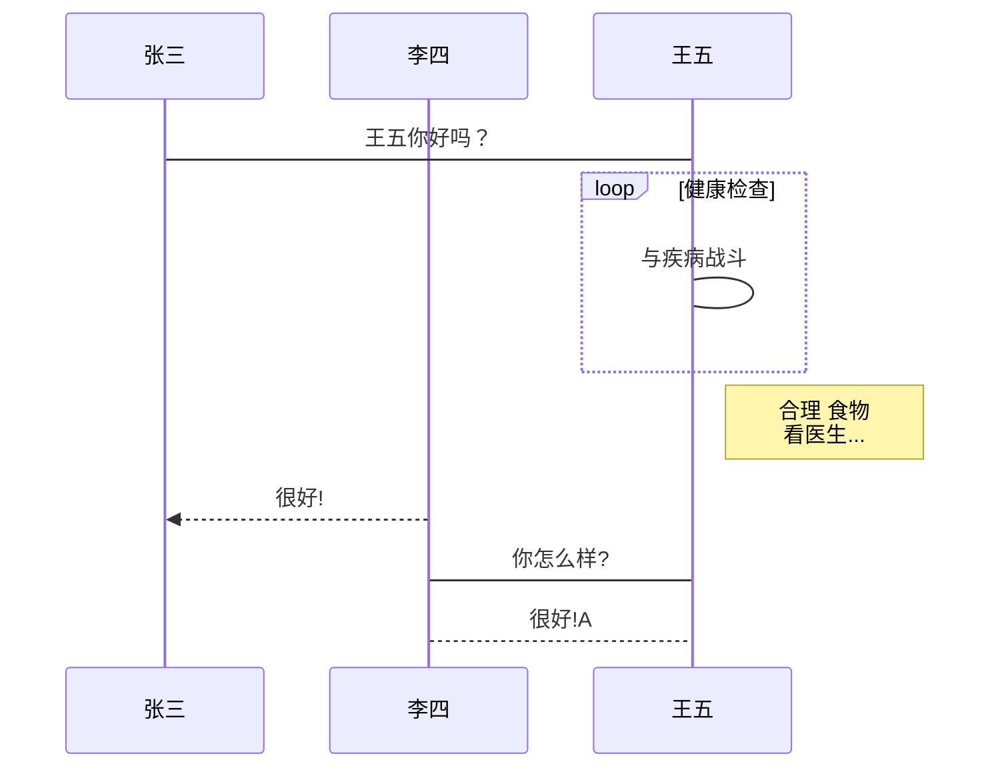
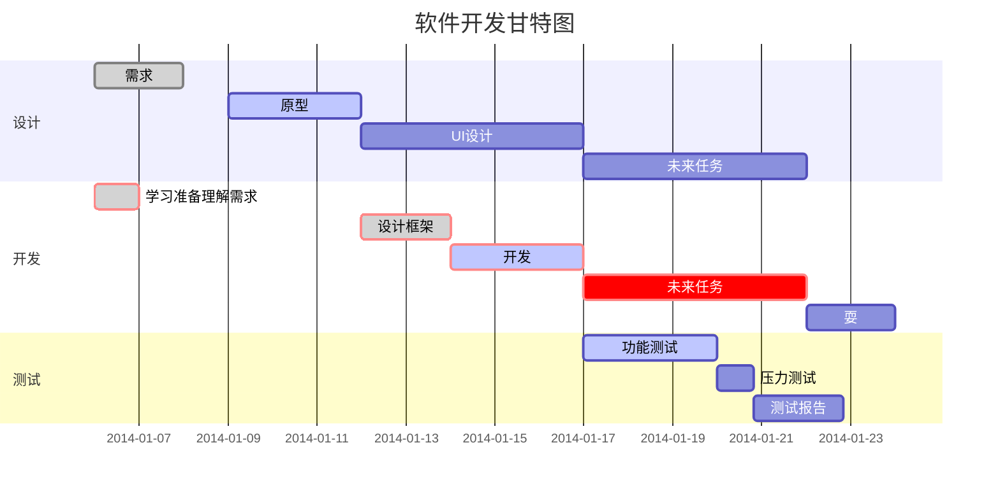
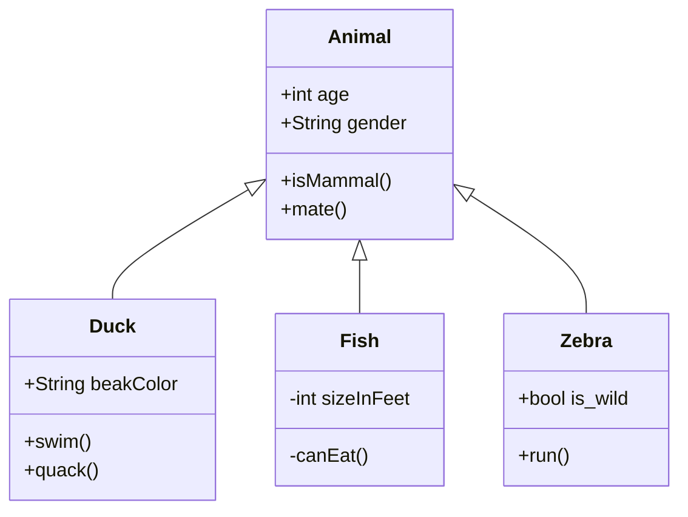
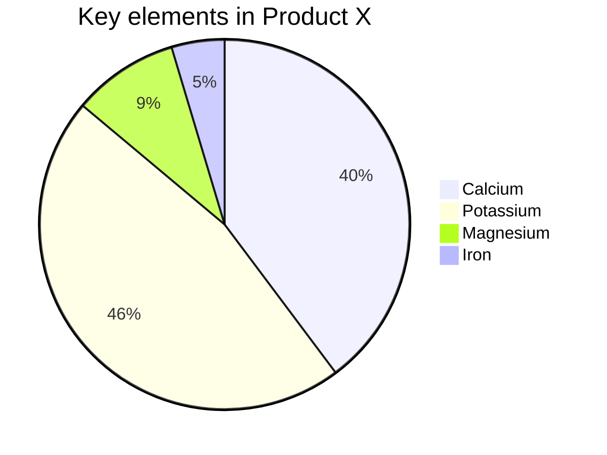

** {{ title }} ** <Excerpt in index | 首页摘要>


<!-- more -->

**Typora内置了对Mermaid的支持，才阔以画各种图。
**

### 使用方法：

首先在 Typora 中，输入 ```mermaid 然后敲击回车，即可初始化一张空白图。
上面的三个```也就是esc健对应下面的健。
在空白处输入下面的源码即可，按照mermaid语法格式来操作即可。


### 一、流程图
##### 1）、竖向（TD 表示从上到下）



##### 2）、横向（LR 表示从左到右）



##### 3）、标准（竖向）

先输入```flow 然后敲击回车，在输入栏，输入下面的语法即可。

```flow
st=>start: 开始框
 
op=>operation: 处理框
 
cond=>condition: 判断框(是或否?)
 
sub1=>subroutine: 子流程
 
io=>inputoutput: 输入输出框
 
e=>end: 结束框
 
st->op->cond
 
cond(yes)->io->e
 
cond(no)->sub1(right)->op
```

##### **4）、标准（横向）**

```flow
st=>start: 开始框
 
op=>operation: 处理框
 
cond=>condition: 判断框(是或否?)
 
sub1=>subroutine: 子流程
 
io=>inputoutput: 输入输出框
 
e=>end: 结束框
 
st(right)->op(right)->cond
 
cond(yes)->io(bottom)->e
 
cond(no)->sub1(right)->op
```


### 二、UML时序图  

- **先输入```mermaid (或）sequence**
- **->> 代表实线箭头，–>> 则代表虚线箭头**
- **-> 直线，–>虚线**
- **使用sequenceDiagram 则不使用``sequence**

##### **1）、简单**




##### 2）、复杂

###### 复杂1-备注


```mermaid
sequenceDiagram
		title:标题：复杂使用
		对象A->>对象B:对象B你好吗（请求）
		Note right of 对象B:对象B的描述（提示）
		Note left of 对象A:提示
		对象B-->>对象A:我很好（响应）
		对象B->>对象C:你好吗？
		对象C-->>对象A: B找我了
		对象A->>对象B:你确定？
		note over 对象C,对象B:朋友
		participant D
		note right of D:没人陪我
```


###### 复杂2-循环




###### 复杂3-alt

```mermaid
sequenceDiagram
		participant A
		participant B
		participant C
		participant D
		title:"练习时序图"
		A->>B:request
		B->>B:verify sign
		B->>C:123
		C-->>B:321
		B->>C:456
		C->>C:code
		C->>D:789
		D-->>B:987
		alt yes
		Note right of B:yes的结果
		else no
		B-->>D:login
		D-->>B:login success
		end
		B->>B:加密
		B-->>A:return 
```


###### 复杂4-alt-loop-note-activate-rect -opt-par

```mermaid
sequenceDiagram
		title:时序图例子
		Alice->>Alice:自言自语
		Alice-->>John:hello john,
		%% over 可以用于单独一个角色上，也可以用于相邻的两个角色间：
		note over Alice,John:friend
		
		%% loop 后跟循环体说明文字
		loop healthcheck
			John-->>John:Fight agaist hypochondra
		end
		
		note right of John: Rational
		
		John-->>Alice:Great!
		John->>Bob:How about you?
		
		%% 控制焦点：用来表示时序图中对象执行某个操作的一段时间
		%% activate 角色名：表示激活控制焦点
		activate Bob
		Bob-->>John:Jolly good!
		%% deactivate 角色名 表示控制焦点结束
    deactivate Bob
    
    Alice->>+Bob: Hello Bob, how are you?
    
    rect rgb(175, 255, 212)
    alt is sick
    Bob-->>Alice: Not so good :(
    else is well
    Bob-->>Alice: Feeling fresh like a daisy
    end
    opt Extra response
    Bob-->>Alice: Thanks for asking
    end
    end
    
    loop communicating
        Alice->>+John: asking some questions
        John-->>-Alice: answer 
    end
    
    par Alice to John
      Alice->>John: Bye
    and Alice to Bob
      Alice->>Bob: Bye
    end
		Alice-xJohn: 这是一个异步调用
    Alice--xBob: 这是一个异步调用
```


##### 3）、标准




### 三、甘特图 




### 四、类图

**语法解释：`<|--` 表示继承，`+` 表示 `public`，`-` 表示 `private, #表示`Protected，**~**表示Package/Internal（包或内部类）**




### 五、**状态图**


### **六、饼图**




### 参考

[https://blog.csdn.net/u010164190/article/details/128190915](https://blog.csdn.net/u010164190/article/details/128190915)

