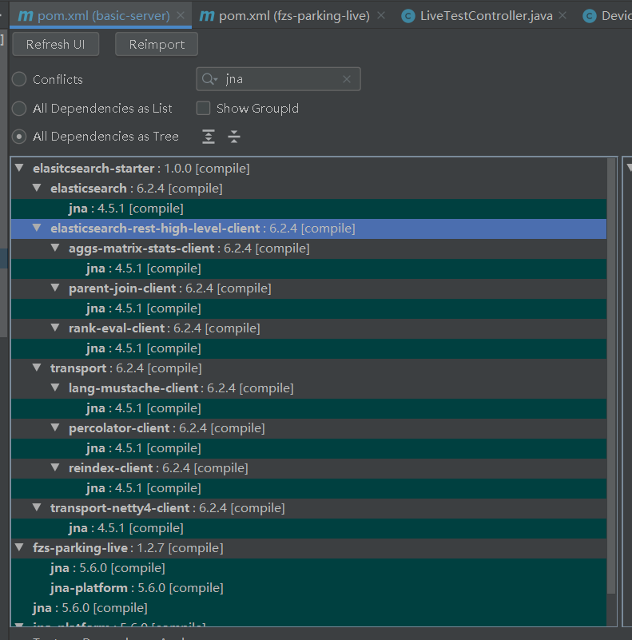

** {{ title }} ** <Excerpt in index | 首页摘要>


<!-- more -->

#### NoSuchMethodError: com.sun.jna.Native.load(Ljava/lang/String;Ljava/lang/Class;Ljava/util/Map;)Lcom/sun/jna/Library;

basic-server项目一直报这个错，找了好久，才发现是elasticsearch里面引入了jna-4.5.1,而这个jar包比较旧的
```java
8228@LAPTOP-6VJBADD9
tasklist /fi "imagename eq ffmpeg.exe" /fo list
5e1d82e8d5dee1224447267b/5d7f9944d5de554b6d29241b 输出线程执行完毕
Exception in thread "Thread-48" java.lang.NoSuchMethodError: com.sun.jna.Native.load(Ljava/lang/String;Ljava/lang/Class;Ljava/util/Map;)Lcom/sun/jna/Library;
	at com.sun.jna.platform.win32.Kernel32.<clinit>(Kernel32.java:42)
	at com.fzs.parking.live.util.ProcessUtil.getPid(ProcessUtil.java:101)
	at com.fzs.parking.live.service.impl.ProcessServiceImpl.getFFmpegIdByProcess(ProcessServiceImpl.java:149)
	at com.fzs.parking.live.service.impl.ProcessServiceImpl.assembleProcessId(ProcessServiceImpl.java:76)
	at com.fzs.parking.live.service.impl.ProcessServiceImpl.processHandle(ProcessServiceImpl.java:38)
	at com.fzs.parking.live.service.impl.DeviceLiveServiceImpl$1.start(DeviceLiveServiceImpl.java:119)
	at com.phone580.avserver.FFmpegCommandManagerImpl$1$1.start(FFmpegCommandManagerImpl.java:190)
	at com.phone580.avserver.handler.TaskHandlerImpl$1.start(TaskHandlerImpl.java:37)
	at com.phone580.avserver.handler.OutMsgHandler.run(OutMsgHandler.java:118)
tasklist /fi "imagename eq ffmpeg.exe" /fo list
2023-01-10 15:26:35,234 http-nio-8180-exec-2 INFO com.basic.util.aop.WebExceptionConfig:37 [http-nio-8180-exec-2] org.springframework.web.util.NestedServletException: Handler dispatch failed; nested exception is java.lang.NoClassDefFoundError: Could not initialize class com.sun.jna.platform.win32.Kernel32
	at org.springframework.web.servlet.DispatcherServlet.doDispatch(DispatcherServlet.java:1055)
	at org.springframework.web.servlet.DispatcherServlet.doService(DispatcherServlet.java:943)
	at org.springframework.web.servlet.FrameworkServlet.processRequest(FrameworkServlet.java:1006)
	at org.springframework.web.servlet.FrameworkServlet.doGet(FrameworkServlet.java:898)
	at javax.servlet.http.HttpServlet.service(HttpServlet.java:645)
	at org.springframework.web.servlet.FrameworkServlet.service(FrameworkServlet.java:883)
	at javax.servlet.http.HttpServlet.service(HttpServlet.java:750)
	at org.apache.catalina.core.ApplicationFilterChain.internalDoFilter(ApplicationFilterChain.java:231)
	at org.apache.catalina.core.ApplicationFilterChain.doFilter(ApplicationFilterChain.java:166)
	at org.apache.tomcat.websocket.server.WsFilter.doFilter(WsFilter.java:53)
	at org.apache.catalina.core.ApplicationFilterChain.internalDoFilter(ApplicationFilterChain.java:193)
	at org.apache.catalina.core.ApplicationFilterChain.doFilter(ApplicationFilterChain.java:166)
	at com.basic.config.CorsFilter.doFilter(CorsFilter.java:31)
	at org.apache.catalina.core.ApplicationFilterChain.internalDoFilter(ApplicationFilterChain.java:193)
	at org.apache.catalina.core.ApplicationFilterChain.doFilter(ApplicationFilterChain.java:166)
	at com.basic.config.AccessControlFilter.doFilter(AccessControlFilter.java:45)
	at org.apache.catalina.core.ApplicationFilterChain.internalDoFilter(ApplicationFilterChain.java:193)
	at org.apache.catalina.core.ApplicationFilterChain.doFilter(ApplicationFilterChain.java:166)
	at com.basic.config.AccessControlFilter.doFilter(AccessControlFilter.java:45)
	at org.apache.catalina.core.ApplicationFilterChain.internalDoFilter(ApplicationFilterChain.java:193)
	at org.apache.catalina.core.ApplicationFilterChain.doFilter(ApplicationFilterChain.java:166)
	at org.springframework.boot.actuate.metrics.web.servlet.WebMvcMetricsFilter.doFilterInternal(WebMvcMetricsFilter.java:93)
	at org.springframework.web.filter.OncePerRequestFilter.doFilter(OncePerRequestFilter.java:119)
	at org.apache.catalina.core.ApplicationFilterChain.internalDoFilter(ApplicationFilterChain.java:193)
	at org.apache.catalina.core.ApplicationFilterChain.doFilter(ApplicationFilterChain.java:166)
	at org.springframework.web.filter.CharacterEncodingFilter.doFilterInternal(CharacterEncodingFilter.java:201)
	at org.springframework.web.filter.OncePerRequestFilter.doFilter(OncePerRequestFilter.java:119)
	at org.apache.catalina.core.ApplicationFilterChain.internalDoFilter(ApplicationFilterChain.java:193)
	at org.apache.catalina.core.ApplicationFilterChain.doFilter(ApplicationFilterChain.java:166)
	at org.apache.catalina.core.StandardWrapperValve.invoke(StandardWrapperValve.java:202)
	at org.apache.catalina.core.StandardContextValve.invoke(StandardContextValve.java:97)
	at org.apache.catalina.authenticator.AuthenticatorBase.invoke(AuthenticatorBase.java:541)
	at org.apache.catalina.core.StandardHostValve.invoke(StandardHostValve.java:143)
	at org.apache.catalina.valves.ErrorReportValve.invoke(ErrorReportValve.java:92)
	at org.apache.catalina.core.StandardEngineValve.invoke(StandardEngineValve.java:78)
	at org.apache.catalina.connector.CoyoteAdapter.service(CoyoteAdapter.java:343)
	at org.apache.coyote.http11.Http11Processor.service(Http11Processor.java:374)
	at org.apache.coyote.AbstractProcessorLight.process(AbstractProcessorLight.java:65)
	at org.apache.coyote.AbstractProtocol$ConnectionHandler.process(AbstractProtocol.java:868)
	at org.apache.tomcat.util.net.NioEndpoint$SocketProcessor.doRun(NioEndpoint.java:1590)
	at org.apache.tomcat.util.net.SocketProcessorBase.run(SocketProcessorBase.java:49)
	at java.util.concurrent.ThreadPoolExecutor.runWorker(ThreadPoolExecutor.java:1142)
	at java.util.concurrent.ThreadPoolExecutor$Worker.run(ThreadPoolExecutor.java:617)
	at org.apache.tomcat.util.threads.TaskThread$WrappingRunnable.run(TaskThread.java:61)
	at java.lang.Thread.run(Thread.java:745)
Caused by: java.lang.NoClassDefFoundError: Could not initialize class com.sun.jna.platform.win32.Kernel32
	at com.fzs.parking.live.util.ProcessUtil.getPid(ProcessUtil.java:101)
	at com.fzs.parking.live.service.impl.ProcessServiceImpl.getFFmpegIdByProcess(ProcessServiceImpl.java:149)
	at com.fzs.parking.live.service.impl.DeviceLiveServiceImpl.getFFmpegIdByProcess(DeviceLiveServiceImpl.java:494)
	at com.basic.controller.live.LiveTestController.startLive(LiveTestController.java:168)
	at com.basic.controller.live.LiveTestController$$FastClassBySpringCGLIB$$3a8f7d77.invoke(<generated>)
	at org.springframework.cglib.proxy.MethodProxy.invoke(MethodProxy.java:218)
	at org.springframework.aop.framework.CglibAopProxy$CglibMethodInvocation.invokeJoinpoint(CglibAopProxy.java:771)
	at org.springframework.aop.framework.ReflectiveMethodInvocation.proceed(ReflectiveMethodInvocation.java:163)
	at org.springframework.aop.framework.CglibAopProxy$CglibMethodInvocation.proceed(CglibAopProxy.java:749)
	at org.springframework.aop.aspectj.MethodInvocationProceedingJoinPoint.proceed(MethodInvocationProceedingJoinPoint.java:88)
	at com.basic.config.ControllerLogAspect.around(ControllerLogAspect.java:113)
	at sun.reflect.NativeMethodAccessorImpl.invoke0(Native Method)
	at sun.reflect.NativeMethodAccessorImpl.invoke(NativeMethodAccessorImpl.java:62)
	at sun.reflect.DelegatingMethodAccessorImpl.invoke(DelegatingMethodAccessorImpl.java:43)
	at java.lang.reflect.Method.invoke(Method.java:498)
	at org.springframework.aop.aspectj.AbstractAspectJAdvice.invokeAdviceMethodWithGivenArgs(AbstractAspectJAdvice.java:644)
	at org.springframework.aop.aspectj.AbstractAspectJAdvice.invokeAdviceMethod(AbstractAspectJAdvice.java:633)
	at org.springframework.aop.aspectj.AspectJAroundAdvice.invoke(AspectJAroundAdvice.java:70)
	at org.springframework.aop.framework.ReflectiveMethodInvocation.proceed(ReflectiveMethodInvocation.java:186)
	at org.springframework.aop.framework.CglibAopProxy$CglibMethodInvocation.proceed(CglibAopProxy.java:749)
	at org.springframework.aop.interceptor.ExposeInvocationInterceptor.invoke(ExposeInvocationInterceptor.java:95)
	at org.springframework.aop.framework.ReflectiveMethodInvocation.proceed(ReflectiveMethodInvocation.java:186)
	at org.springframework.aop.framework.CglibAopProxy$CglibMethodInvocation.proceed(CglibAopProxy.java:749)
	at org.springframework.aop.framework.CglibAopProxy$DynamicAdvisedInterceptor.intercept(CglibAopProxy.java:691)
	at com.basic.controller.live.LiveTestController$$EnhancerBySpringCGLIB$$e45fdac9.startLive(<generated>)
	at sun.reflect.NativeMethodAccessorImpl.invoke0(Native Method)
	at sun.reflect.NativeMethodAccessorImpl.invoke(NativeMethodAccessorImpl.java:62)
	at sun.reflect.DelegatingMethodAccessorImpl.invoke(DelegatingMethodAccessorImpl.java:43)
	at java.lang.reflect.Method.invoke(Method.java:498)
	at org.springframework.web.method.support.InvocableHandlerMethod.doInvoke(InvocableHandlerMethod.java:190)
	at org.springframework.web.method.support.InvocableHandlerMethod.invokeForRequest(InvocableHandlerMethod.java:138)
	at org.springframework.web.servlet.mvc.method.annotation.ServletInvocableHandlerMethod.invokeAndHandle(ServletInvocableHandlerMethod.java:105)
	at org.springframework.web.servlet.mvc.method.annotation.RequestMappingHandlerAdapter.invokeHandlerMethod(RequestMappingHandlerAdapter.java:878)
	at org.springframework.web.servlet.mvc.method.annotation.RequestMappingHandlerAdapter.handleInternal(RequestMappingHandlerAdapter.java:792)
	at org.springframework.web.servlet.mvc.method.AbstractHandlerMethodAdapter.handle(AbstractHandlerMethodAdapter.java:87)
	at org.springframework.web.servlet.DispatcherServlet.doDispatch(DispatcherServlet.java:1040)
	... 44 more


```

看下图，利用dependency analyzer可以看到elasticsearch自带了jna包


解决办法：干掉elasticsearch或者引入elasticsearch时干掉jna
注意groupId为org.elasticsearch，和上面的jna有点不一样

```java
            <exclusions>
                <exclusion>
                    <groupId>org.elasticsearch</groupId>
                    <artifactId>jna</artifactId>
                </exclusion>
            </exclusions>

```

参考：
[https://www.codenong.com/55982008/](https://www.codenong.com/55982008/)
里面说的
与JNA相关的NoSuchMethodError几乎总是与在您的依赖项列表中某处拥有较旧版本的JNA有关，即使您也具有当前版本
非常有用


