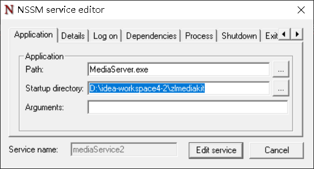

** {{ title }} ** <Excerpt in index | 首页摘要>


<!-- more -->


#### nssm做成window服务
nssm和上面instsrv+srvany的原理是一样的，而且还简单点，都是弄到注册表和服务哪里

拷贝nssm.exe到对应目录下，执行
```java
nssm install mediaService
```
其中mediaService是服务名  
这时会弹出一个界面  

application path项输入
```java
MediaServer.exe
```
startup directory输入
```java
D:\idea-workspace4-2\zlmediakit
```


然后点install即可安装服务，这时去到服务下可以看到新建的服务，或者去到注册表下也可以看到
```java
HKEY_LOCAL_MACHINE\SYSTEM\CurrentControlSet\Services\mediaService\Parameters\
```


#### instsrv+srvany做成window服务

[https://www.cnblogs.com/firespeed/p/16867825.html](https://www.cnblogs.com/firespeed/p/16867825.html)
[https://blog.csdn.net/okmkjh/article/details/120486544](https://blog.csdn.net/okmkjh/article/details/120486544)     
[https://www.modb.pro/db/424196](https://www.modb.pro/db/424196)

去到instsrv.exe的目录下，才能执行instsrv命令

貌似按文章介绍的弄了，注册表弄出的服务的不完整的，不知道为什么

install.bat

```java
@echo off
cd /d %~dp0
call run-install.bat  mediaService "D:\idea-workspace4-2\zlmediakit\MediaServer.exe"
pause  
 ```

run-install.bat
```java
@echo off

rem 参数依次为 服务名称 可执行文件名称
@echo 服务名称:%1
@echo 程序名称:%2

rem 定义需要运行的程序路径
set curExe=%~dp0%2
rem 定义注册表路径
set regpath=HKEY_LOCAL_MACHINE\SYSTEM\CurrentControlSet\Services\mediaService\Parameters\
rem 定义srvany.exe文件路径
set sourcePath=%~dp0srvany.exe

rem 进入当前目录
cd /d "%~dp0"
rem 安装引导服务
instsrv %1  "%sourcePath%"
@echo 服务添加完成

rem 添加注册表语法: reg add 注册表路径 /v 项名称 /t 值类型 /d 数据 /f 表示强行修改不提示

rem 名称 Application 值为你要作为服务运行的程序地址 /d对应的参数有斜杠不是为了转义引号，而是路径还有斜杠，默认将引号转义了，额外添加斜杠是为了保留引号
reg add %regpath% /v AppDirectory /t REG_SZ /d "%~dp0\" /f

rem 名称 AppDirectory 值为你要作为服务运行的程序所在文件夹路径
reg add %regpath% /v Application /t REG_SZ /d "%curExe%" /f 

rem 名称 AppParameters 值为你要作为服务运行的程序启动所需要的参数
reg add %regpath% /v AppParameters /t REG_SZ /f
@echo 注册表添加完成

```


del.bat
```java
@echo off
cd /d %~dp0
call run-del.bat  mediaService
pause

```

run-del.bat
```java
@echo off

rem 参数依次为 你的服务名称
@echo 你的服务名称:%1

rem 进入当前目录
cd /d %~dp0
rem 停止服务
net stop %1
rem 卸载引导服务
instsrv %1 remove

```

