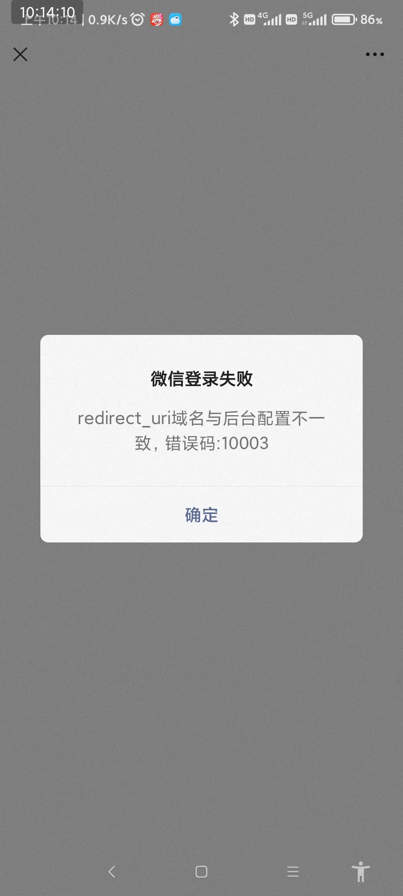

** {{ title }} ** <Excerpt in index | 首页摘要>

<!-- more -->

#### 网页授权

https://developers.weixin.qq.com/doc/offiaccount/OA_Web_Apps/Wechat_webpage_authorization.html

第一步：用户同意授权，获取code
在确保微信公众账号拥有授权作用域（scope参数）的权限的前提下（已认证服务号，默认拥有scope参数中的snsapi_base和snsapi_userinfo 权限），引导关注者打开如下页面：

https://open.weixin.qq.com/connect/oauth2/authorize?appid=APPID&redirect_uri=REDIRECT_URI&response_type=code&scope=SCOPE&state=STATE#wechat_redirect

组装好参数后发消息到微信公众号，然后打开，提示下面
比如：https://open.weixin.qq.com/connect/oauth2/authorize?appid=xxx&redirect_uri=http%3A%2F%2Fdevelopers.weixin.qq.com&response_type=code&scope=snsapi_userinfo&state=STATE#wechat_redirect

应该是要在这下面JS接口安全域名或者是网页授权域名

#### 公众号开发

多个公众号配置
https://github.com/binarywang/weixin-java-mp-demo

多个公众号账号支付配置
https://github.com/Wechat-Group/WxJava/tree/develop/others/weixin-java-config

网上教程
微信小程序生态6-微信公众号授权登录(适用于H5小程序)
https://blog.csdn.net/weixin_33005117/article/details/125100105

#### 

