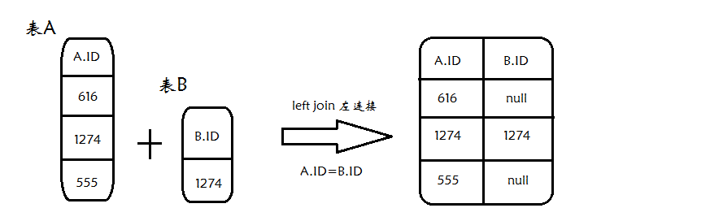

** {{ title }} ** <Excerpt in index | 首页摘要>


<!-- more -->

#### 
A、B两表，找出ID字段中，存在A表，但是不存在B表的数据。A表总共13w数据，去重后大约3W条数据，B表有2W条数据，且B表的ID字段有索引。

##### 方法一
　　使用 not in ,容易理解,效率低

```java
select distinct A.ID from  A where A.ID not in (select ID from B)
```


[SQL查询~ 存在一个表而不在另一个表中的数据](https://www.cnblogs.com/jameshappy/p/6038706.html)


##### 方法二

使用 left join...on... , "B.ID isnull" 表示左连接之后在B.ID 字段为 null的记录 
     
```java
 select A.ID from A left join B on A.ID=B.ID where B.ID is null
```


#####  方法三
逻辑相对复杂,但是速度最快 

```java
 select * from  B 
    where (select count(1) as num from A where A.ID = B.ID) = 0
```


1. 
2. 
3. 
